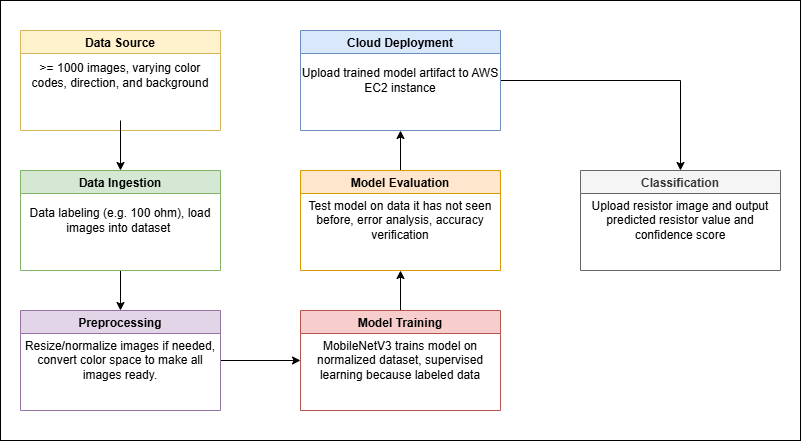
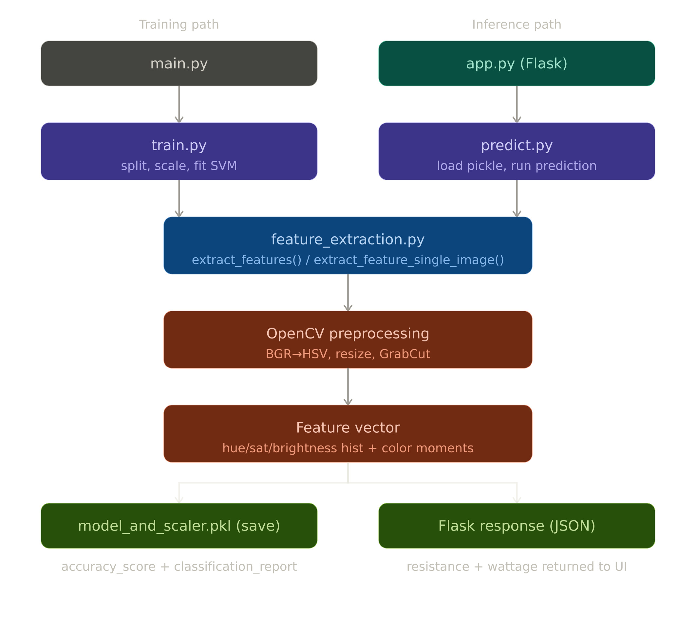

# ResistorClassification

ML project that classifies resistor images by resistance value (ohms) and wattage using a multi-output SVM with HSV color features.

## System Diagram



## Pipeline



## Getting Started (Ubuntu)

### Prerequisites

- Python 3.12+
- AWS credentials (to download dataset)

### 1. Clone and set up environment

```bash
git clone <repo-url>
cd ResistorClassification
python3 -m venv venv
source venv/bin/activate
pip install -r requirements.txt
```

### 2. Download the dataset

Requires AWS credentials with access to the `resistor-classifier` S3 bucket.

```bash
./download_dataset.sh
```

Choose option `2` (cleaned dataset) for best results. Dataset downloads to `archive_clean/`.

Images must be named `<resistance>_<wattage>_<anything>.jpg` — the filename encodes the labels.

### 3. Train the model

```bash
cd python
python3 train.py
```

Outputs `model_and_scaler.pkl` in the `python/` directory.

### 4. Run the Flask server

```bash
cd python
python3 app.py
```

Server listens on `0.0.0.0:5000`. Navigate to `http://localhost:5000/resistor-classifier` to upload a resistor image and get a prediction.

For production use:

```bash
cd python
gunicorn -w 4 -b 0.0.0.0:5000 app:app
```

### Project Structure

```
ResistorClassification/
├── python/
│   ├── app.py                  # Flask web server
│   ├── predict.py              # Inference logic
│   ├── train.py                # Model training
│   ├── feature_extraction.py   # HSV histogram feature extraction
│   ├── model_and_scaler.pkl    # Trained model (after training)
│   ├── templates/              # HTML templates
│   └── static/                 # Static assets and upload folder
├── diagrams/                   # System and pipeline diagrams
├── docs/                       # Project documentation
├── download_dataset.sh         # AWS S3 dataset download script
└── requirements.txt
```

## How It Works

1. Input image is converted to HSV color space
2. Hue, saturation, and brightness histograms are computed along with mean, std, and skew
3. Feature vector fed into a multi-output SVM classifier
4. Model predicts resistance value and wattage simultaneously
